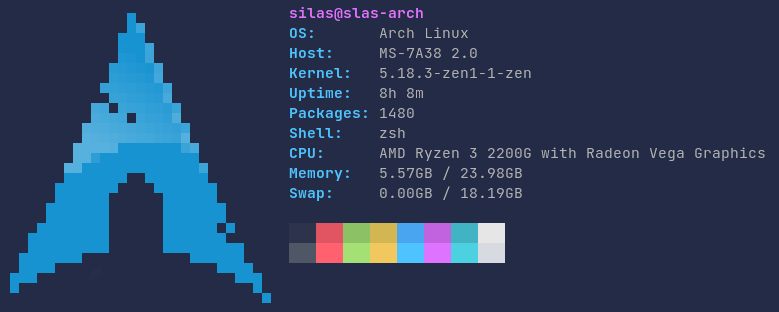

# pixfetch
A fetch program with variable sized pixel images

## Configuration
pixfetch can be configured using a config file in `$XDG_CONFIG_HOME/pixfetch/config.toml` or when `$XDG_CONFIG_HOME` is not set in `$HOME/.config/pixfetch/config.toml`. To see all options you can have a look at the [default configuration file](src/default_config.toml).

Additionally, all configuration can also be overridden with flags from the command line. To see those options run `pixfetch --help` or `pixfetch -h` for shorter descriptions.
